<div align="center">

<!-- ██████╗ ANIMATED HEADER ██████╗ -->


<br/>

<!-- LIVE BADGES ROW 1 -->
<a href="https://health-care-management-platforn-ae4.vercel.app/">
  
</a>
<a href="https://healthcare-managementplatforn.onrender.com">
  
</a>
<a href="https://hub.docker.com/repository/docker/ragas111/healthmanagement-backend/general">
  
</a>

<br/><br/>

<!-- TECH STACK BADGES -->


<br/><br/>

<!-- STATUS BADGES -->


</div>

---

<!-- ═══════════════════════════════════════════════════════════════════════ -->
## 🧬 What is MediCore?
<!-- ═══════════════════════════════════════════════════════════════════════ -->

> **MediCore** is a full-stack, production-grade **Healthcare Patient Management Platform** built for real-time clinical workflows. It features a FastAPI backend with automatic BMI computation, intelligent health-status verdicts, paginated search, sorted analytics — all served through a beautifully animated frontend with GSAP transitions, responsive cards, and a live dashboard.

```
┌─────────────────────────────────────────────────────────────────┐
│  🏥  CREATE  →  READ  →  UPDATE  →  DELETE  →  ANALYSE          │
│      patients    records   vitals     records    BMI trends      │
└─────────────────────────────────────────────────────────────────┘
```

---

<!-- ═══════════════════════════════════════════════════════════════════════ -->
## 🎬 Live Demo (App Walkthrough)
<!-- ═══════════════════════════════════════════════════════════════════════ -->

<div align="center">

### 🖥️ Dashboard & Patient Grid
<!-- GIF PLACEHOLDER — Replace with screen recording of dashboard -->
```
╔══════════════════════════════════════════════════════════╗
║                                                          ║
║       [ 📽️  INSERT DASHBOARD GIF HERE ]                  ║
║                                                          ║
║   Recommended: Screen capture of the hero section,      ║
║   stat cards animating in, and patient grid loading.    ║
║   Tool: Loom / ShareX / Kap (macOS)                     ║
║   Size: 800×450px, < 5MB                                ║
╚══════════════════════════════════════════════════════════╝
```

### ➕ Add / Edit Patient Flow
<!-- GIF PLACEHOLDER — Replace with screen recording of add/edit modal -->
```
╔══════════════════════════════════════════════════════════╗
║                                                          ║
║       [ 📽️  INSERT ADD-PATIENT GIF HERE ]                ║
║                                                          ║
║   Recommended: Modal open → form fill → save toast      ║
║   showing auto-calculated BMI + verdict on the card.    ║
╚══════════════════════════════════════════════════════════╝
```

### 🔍 Search, Sort & Pagination
<!-- GIF PLACEHOLDER — Replace with screen recording of search/sort -->
```
╔══════════════════════════════════════════════════════════╗
║                                                          ║
║       [ 📽️  INSERT SEARCH-SORT GIF HERE ]                ║
║                                                          ║
║   Recommended: Typing in search bar → live filter,      ║
║   then BMI sort toggle, then pagination navigation.     ║
╚══════════════════════════════════════════════════════════╝
```

### 🗑️ Delete & ID Reorder
<!-- GIF PLACEHOLDER — Replace with delete confirmation + reorder -->
```
╔══════════════════════════════════════════════════════════╗
║                                                          ║
║       [ 📽️  INSERT DELETE GIF HERE ]                     ║
║                                                          ║
║   Recommended: Click delete → confirm modal →           ║
║   card vanishes → IDs reordered seamlessly.             ║
╚══════════════════════════════════════════════════════════╝
```

</div>

---

<!-- ═══════════════════════════════════════════════════════════════════════ -->
## 🏗️ System Architecture
<!-- ═══════════════════════════════════════════════════════════════════════ -->

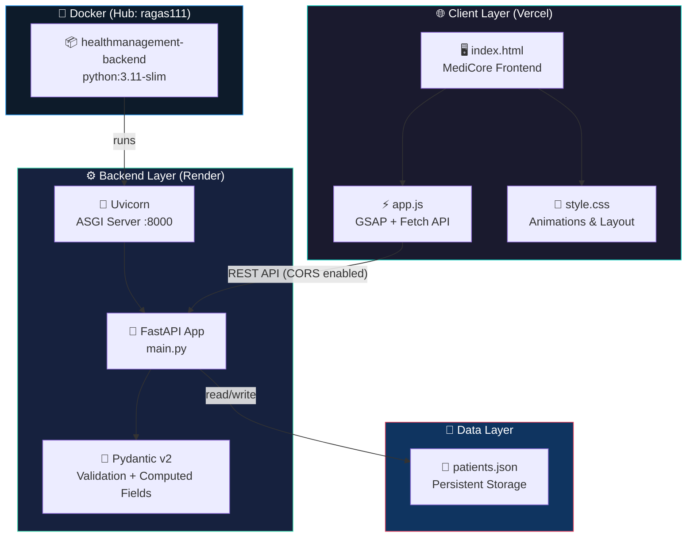

---

<!-- ═══════════════════════════════════════════════════════════════════════ -->
## 🔄 Request Lifecycle
<!-- ═══════════════════════════════════════════════════════════════════════ -->

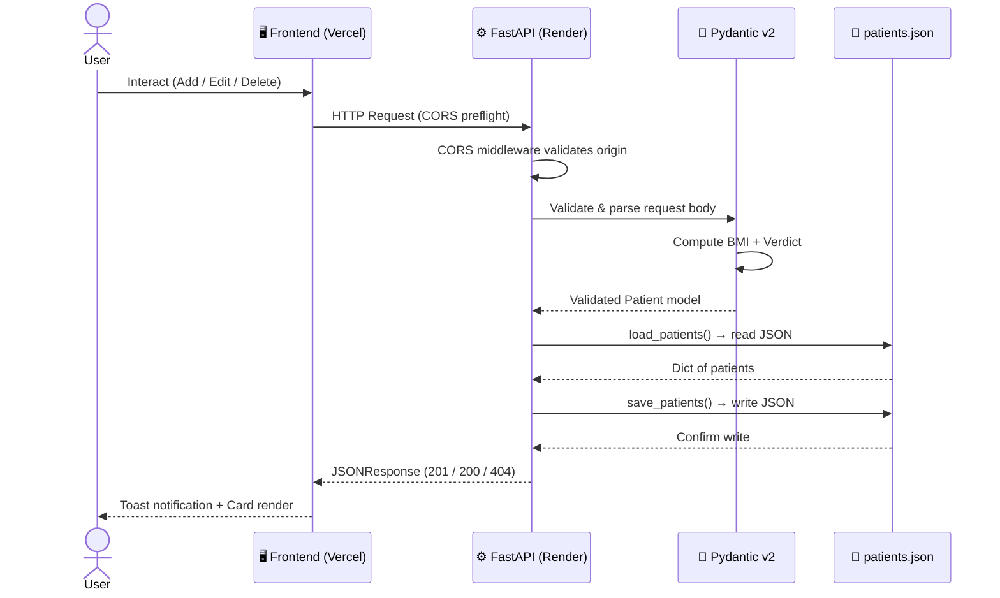

---

<!-- ═══════════════════════════════════════════════════════════════════════ -->
## 📊 Data Model & BMI Engine
<!-- ═══════════════════════════════════════════════════════════════════════ -->

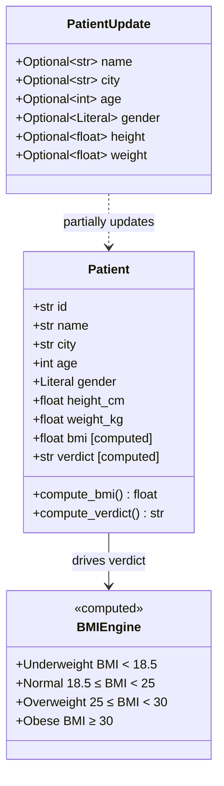

### 🧮 BMI Computation

```
         weight (kg)
BMI = ─────────────────     →   rounded to 2 decimal places
       height² (meters)
```

| Verdict | BMI Range | Badge |
|---------|-----------|-------|
| 🟦 Underweight | `< 18.5` |  |
| 🟩 Normal | `18.5 – 24.9` |  |
| 🟨 Overweight | `25 – 29.9` |  |
| 🟥 Obese | `≥ 30` |  |

---

<!-- ═══════════════════════════════════════════════════════════════════════ -->
## 📡 API Reference — Complete Endpoint Map
<!-- ═══════════════════════════════════════════════════════════════════════ -->

<div align="center">
<b>Base URL:</b> <code>https://healthcare-managementplatforn.onrender.com</code>
</div>

<br/>

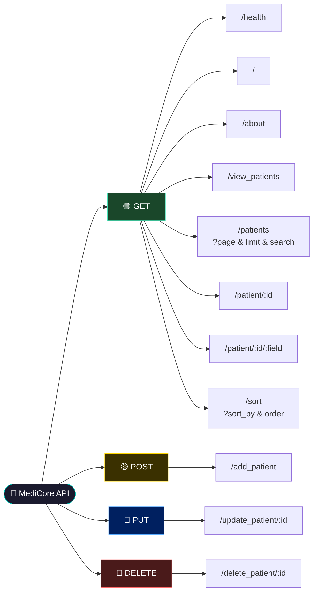

---

### 🟢 GET Endpoints

#### `GET /health`
> System health probe — returns live status.

```http
GET https://healthcare-managementplatforn.onrender.com/health
```

**Response `200 OK`**
```json
{ "status": "healthy" }
```

---

#### `GET /patients` — Paginated + Searchable
> Primary listing endpoint with full pagination and search.

```http
GET /patients?page=1&limit=20&search=john
```

| Query Param | Type | Default | Description |
|-------------|------|---------|-------------|
| `page` | `int ≥ 1` | `1` | Page number |
| `limit` | `int 1–100` | `20` | Records per page |
| `search` | `string` | `""` | Filter by name, city, ID, or gender |

**Response `200 OK`**
```json
{
  "data": {
    "P0001": { "name": "John Doe", "city": "Mumbai", "age": 30, "bmi": 22.86, "verdict": "Normal" }
  },
  "total": 150,
  "page": 1,
  "limit": 20,
  "total_pages": 8,
  "has_next": true,
  "has_prev": false
}
```

---

#### `GET /patient/{patient_id}`
> Fetch a single patient's complete record.

```http
GET /patient/P0001
```

**Response `200 OK`**
```json
{
  "name": "John Doe",
  "city": "New Delhi",
  "age": 28,
  "gender": "Male",
  "height": 175.0,
  "weight": 70.0,
  "bmi": 22.86,
  "verdict": "Normal"
}
```

**Response `404 Not Found`**
```json
{ "detail": "Patient not found" }
```

---

#### `GET /patient/{patient_id}/{field}`
> Retrieve a specific field from a patient record.

```http
GET /patient/P0001/bmi
```

**Response `200 OK`**
```json
{ "bmi": 22.86 }
```

**Valid fields:** `name`, `city`, `age`, `gender`, `height`, `weight`, `bmi`, `verdict`

---

#### `GET /sort`
> Sort all patients by a numeric field.

```http
GET /sort?sort_by=bmi&order=desc
```

| Query Param | Options | Description |
|-------------|---------|-------------|
| `sort_by` | `bmi`, `weight`, `height` | Field to sort on |
| `order` | `asc`, `desc` | Ascending or descending |

**Response `200 OK`**
```json
[
  { "name": "Alice", "bmi": 33.2, "verdict": "Obese" },
  { "name": "Bob",   "bmi": 27.1, "verdict": "Overweight" }
]
```

---

### 🟡 POST Endpoint

#### `POST /add_patient`
> Add a new patient. BMI and verdict are **auto-computed** server-side.

```http
POST /add_patient
Content-Type: application/json
```

**Request Body**
```json
{
  "id":     "P0010",
  "name":   "Priya Sharma",
  "city":   "Lucknow",
  "age":    26,
  "gender": "Female",
  "height": 162.0,
  "weight": 58.5
}
```

**Validation Rules**

| Field | Type | Constraint |
|-------|------|------------|
| `id` | `str` | Required, unique |
| `name` | `str` | Required |
| `city` | `str` | Required |
| `age` | `int` | `> 0` |
| `gender` | `Literal` | `Male` \| `Female` \| `Other` |
| `height` | `float` | `> 0` (cm) |
| `weight` | `float` | `> 0` (kg) |

**Response `201 Created`**
```json
{ "message": "Patient added successfully", "patient_id": "P0010" }
```

**Response `400 Bad Request`** (duplicate ID)
```json
{ "detail": "Patient with this ID already exists" }
```

---

### 🔵 PUT Endpoint

#### `PUT /update_patient/{patient_id}`
> Partially update any patient field. Only provided fields are changed. BMI/verdict **recompute automatically** if height or weight changes.

```http
PUT /update_patient/P0010
Content-Type: application/json
```

**Request Body** (all fields optional)
```json
{
  "weight": 62.0,
  "city":   "Kanpur"
}
```

**Response `200 OK`**
```json
{ "message": "Patient updated successfully", "patient_id": "P0010" }
```

**Response `404`** — Patient not found  
**Response `400`** — Invalid field or no fields provided

---

### 🔴 DELETE Endpoint

#### `DELETE /delete_patient/{patient_id}`
> Delete a patient and **automatically reorder all remaining IDs** to maintain a clean sequential gap-free list (P0001, P0002, P0003…).

```http
DELETE /delete_patient/P0003
```

**Before Delete:**
```
P0001 Alice  →  P0001 Alice
P0002 Bob    →  P0002 Bob
P0003 Carol  ✗  [DELETED]
P0004 Dave   →  P0003 Dave  ← reordered
P0005 Eve    →  P0004 Eve   ← reordered
```

**Response `200 OK`**
```json
{
  "message": "Patient deleted and IDs reordered successfully",
  "deleted_id": "P0003"
}
```

---

<!-- ═══════════════════════════════════════════════════════════════════════ -->
## 🔁 CRUD Flow Diagram
<!-- ═══════════════════════════════════════════════════════════════════════ -->

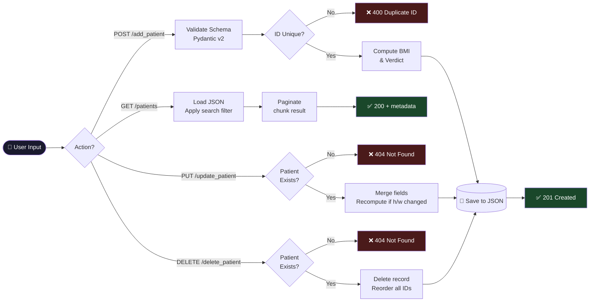

---

<!-- ═══════════════════════════════════════════════════════════════════════ -->
## 📈 Analytics & Platform Metrics
<!-- ═══════════════════════════════════════════════════════════════════════ -->

### 🩺 BMI Distribution (Example Population)

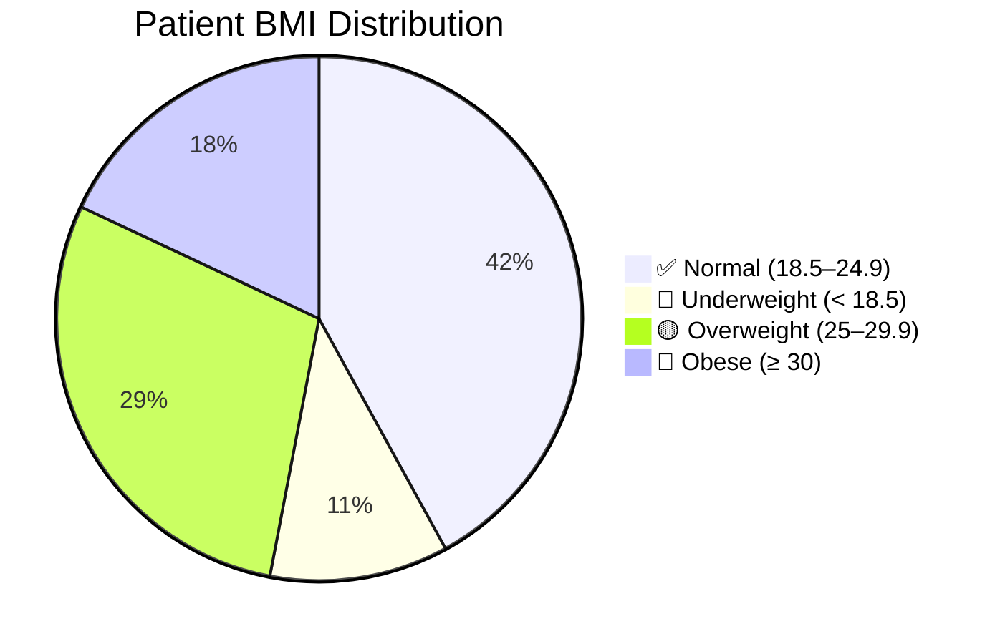

### 👥 Gender Distribution

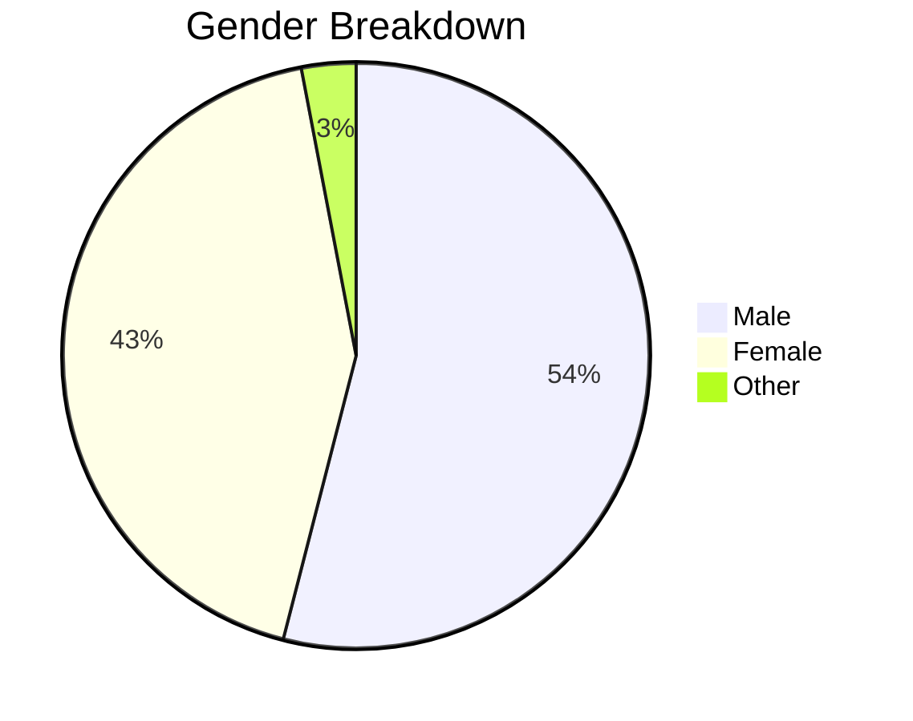

### 📊 Age Group Distribution

```
Age Group Distribution (per 150 patients)
──────────────────────────────────────────
 0 – 18  │████░░░░░░░░░░░░░░░░░│   8 patients
19 – 30  │████████████░░░░░░░░░│  32 patients
31 – 45  │█████████████████░░░░│  45 patients  ← largest group
46 – 60  │███████████████░░░░░░│  38 patients
61 – 75  │████████░░░░░░░░░░░░░│  22 patients
  76+    │██░░░░░░░░░░░░░░░░░░░│   5 patients
──────────────────────────────────────────
```

### 📉 BMI by City (Example)

```
Average BMI by City (example data)
────────────────────────────────────────────────
  Mumbai    │█████████████████████░░░│  23.4
  Delhi     │███████████████████████░│  25.1  ⚠️
  Lucknow   │██████████████████████░░│  24.8
  Bangalore │████████████████████░░░░│  22.9  ✅
  Chennai   │████████████████████████│  26.3  ⚠️
────────────────────────────────────────────────
  Scale: 18 ──────────────────────── 30
```

---

<!-- ═══════════════════════════════════════════════════════════════════════ -->
## 🖼️ Frontend Features
<!-- ═══════════════════════════════════════════════════════════════════════ -->

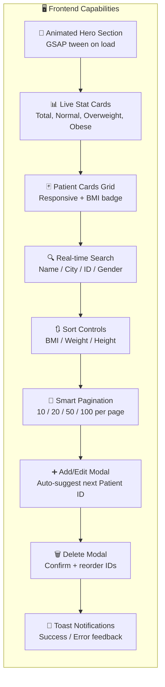

| Feature | Detail |
|---------|--------|
| 🎨 Animation library | **GSAP 3.12** with ScrollTrigger |
| 🅰️ Fonts | Syne + DM Mono + Instrument Sans (Google Fonts) |
| 📱 Responsive | Mobile hamburger menu + adaptive grid |
| 🌑 Theme | Dark clinical design with accent gradients |
| ♿ Accessibility | `aria-modal`, `aria-live`, `aria-label` throughout |
| 🔄 Auto-refresh | Refresh button + search debounce |
| 🔢 ID suggestion | Frontend computes next available `P000X` automatically |

---

<!-- ═══════════════════════════════════════════════════════════════════════ -->
## 🐍 Backend Tech Deep Dive
<!-- ═══════════════════════════════════════════════════════════════════════ -->

```mermaid
graph TD
    subgraph PYDANTIC ["🐍 Pydantic v2 Magic"]
        A[Raw JSON body] --> B[Field validation\ntype + constraints]
        B --> C[Computed Fields\nbmi + verdict]
        C --> D[model_dump\nexclude id]
        D --> E[Stored to JSON]
    end

    subgraph CORS ["🌐 CORS Middleware"]
        F[Any origin *] --> G[All methods\nGET POST PUT DELETE OPTIONS]
        G --> H[All headers allowed]
    end

    subgraph PAGINATION ["📄 Pagination Engine"]
        I[All records] --> J[Apply search filter]
        J --> K[Ceiling division\nfor total_pages]
        K --> L[Slice chunk\nstart:end]
        L --> M[Return + metadata]
    end
```

### Key Backend Design Decisions

| Decision | Why |
|----------|-----|
| `patients.json` as DB | Zero-dependency persistence, suitable for demo/educational deployments |
| `@computed_field` BMI | Never stale — always recalculated from source height/weight |
| ID reordering on delete | Maintains clean sequential IDs, avoids gaps |
| `exclude_unset=True` on PATCH | Prevents accidental null overwrites on partial updates |
| `python:3.11-slim` Docker base | 70% smaller image than full Python image |

---

<!-- ═══════════════════════════════════════════════════════════════════════ -->
## 🐳 Docker Setup
<!-- ═══════════════════════════════════════════════════════════════════════ -->

### Pull from Docker Hub

```bash
docker pull ragas111/healthmanagement-backend:latest
```

🔗 **Docker Hub:** [ragas111/healthmanagement-backend](https://hub.docker.com/repository/docker/ragas111/healthmanagement-backend/general)

### Run Locally

```bash
# Run the container
docker run -d \
  --name medicore-backend \
  -p 8000:8000 \
  ragas111/healthmanagement-backend:latest

# Check logs
docker logs medicore-backend

# Test health
curl http://localhost:8000/health
```

### Build from Source

```bash
# Clone the repo
git clone https://github.com/RaGaS958/HealthCare_ManagementPlatforn.git
cd HealthCare_ManagementPlatforn/Backend

# Build image
docker build -t medicore-backend .

# Run
docker run -d -p 8000:8000 medicore-backend
```

### Docker Architecture

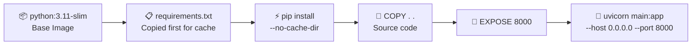

---

<!-- ═══════════════════════════════════════════════════════════════════════ -->
## 🚀 Local Development Setup
<!-- ═══════════════════════════════════════════════════════════════════════ -->

### Prerequisites

```
Python 3.11+   Node.js (optional, for frontend dev)   Docker (optional)
```

### Backend

```bash
# 1. Clone
git clone https://github.com/RaGaS958/HealthCare_ManagementPlatforn.git
cd HealthCare_ManagementPlatforn/Backend

# 2. Create virtual environment
python -m venv venv
source venv/bin/activate      # Linux/macOS
venv\Scripts\activate         # Windows

# 3. Install dependencies
pip install -r requirements.txt

# 4. Run
uvicorn main:app --reload --port 8000

# 5. Open interactive docs
open http://localhost:8000/docs
```

### Frontend

```bash
cd ../Frontend

# No build step needed — plain HTML/CSS/JS
# Just update the API_BASE_URL in app.js if running locally:
# const API_BASE = "http://localhost:8000";

# Serve with any static server:
npx serve .
# OR
python -m http.server 3000
```

### Full Stack (Docker Compose — optional)

```yaml
# docker-compose.yml
version: "3.9"
services:
  backend:
    image: ragas111/healthmanagement-backend:latest
    ports:
      - "8000:8000"
    volumes:
      - ./data:/app   # persist patients.json
  frontend:
    image: nginx:alpine
    ports:
      - "3000:80"
    volumes:
      - ./Frontend:/usr/share/nginx/html
```

```bash
docker compose up -d
```

---

<!-- ═══════════════════════════════════════════════════════════════════════ -->
## 📁 Project Structure
<!-- ═══════════════════════════════════════════════════════════════════════ -->

```
HealthCare_ManagementPlatforn/
│
├── 📁 Backend/
│   ├── 🐍 main.py              # FastAPI app — all routes + Pydantic models
│   ├── 📋 requirements.txt     # Python dependencies
│   ├── 🐳 Dockerfile           # python:3.11-slim container definition
│   ├── 🔒 .dockerignore        # Docker build exclusions
│   └── 📄 patients.json        # JSON flat-file database (auto-created)
│
├── 📁 Frontend/
│   ├── 🌐 index.html           # Full SPA structure + modals
│   ├── ⚡ app.js               # API calls, GSAP animations, UI logic
│   └── 🎨 style.css            # Dark theme + responsive design
│
└── 📖 README.md
```

---

<!-- ═══════════════════════════════════════════════════════════════════════ -->
## 🌐 Deployments
<!-- ═══════════════════════════════════════════════════════════════════════ -->

| Layer | Platform | URL | Status |
|-------|----------|-----|--------|
| 🖥️ Frontend | Vercel | [health-care-management-platforn-ae4.vercel.app](https://health-care-management-platforn-ae4.vercel.app/) |  |
| ⚙️ Backend | Render | [healthcare-managementplatforn.onrender.com](https://healthcare-managementplatforn.onrender.com) |  |
| 🐳 Image | Docker Hub | [ragas111/healthmanagement-backend](https://hub.docker.com/repository/docker/ragas111/healthmanagement-backend/general) |  |

> ⚠️ **Note:** Render free tier may sleep after inactivity — first request can take ~30s to cold start.

---

<!-- ═══════════════════════════════════════════════════════════════════════ -->
## 🔐 API Error Reference
<!-- ═══════════════════════════════════════════════════════════════════════ -->

| HTTP Code | Scenario | Response |
|-----------|----------|----------|
| `200 OK` | Success (GET / PUT) | Data payload |
| `201 Created` | Patient added successfully | `{ "message": "...", "patient_id": "..." }` |
| `400 Bad Request` | Duplicate ID / Invalid field / No update data | `{ "detail": "..." }` |
| `404 Not Found` | Patient or field not found | `{ "detail": "Patient not found" }` |
| `422 Unprocessable` | Pydantic validation failed | Pydantic error details |
| `500 Internal` | JSON file write failure | `{ "detail": "Error saving..." }` |

---

<!-- ═══════════════════════════════════════════════════════════════════════ -->
## ⚡ Dependencies
<!-- ═══════════════════════════════════════════════════════════════════════ -->

### Backend (`requirements.txt`)

| Package | Version | Purpose |
|---------|---------|---------|
| `fastapi` | 0.129.0 | Web framework |
| `pydantic` | 2.12.5 | Data validation + computed fields |
| `uvicorn` | 0.41.0 | ASGI server |
| `starlette` | 0.52.1 | ASGI toolkit (FastAPI base) |
| `pydantic-core` | 2.41.5 | Pydantic Rust core |
| `annotated-types` | 0.7.0 | Type annotation utilities |

### Frontend (CDN)

| Library | Version | Purpose |
|---------|---------|---------|
| GSAP | 3.12.2 | Scroll + entrance animations |
| ScrollTrigger | 3.12.2 | Scroll-based animation triggers |
| Google Fonts | — | Syne, DM Mono, Instrument Sans |

---

<!-- ═══════════════════════════════════════════════════════════════════════ -->
## 🗺️ Roadmap
<!-- ═══════════════════════════════════════════════════════════════════════ -->

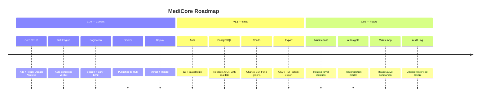

---

<!-- ═══════════════════════════════════════════════════════════════════════ -->
## 📜 License
<!-- ═══════════════════════════════════════════════════════════════════════ -->

<div align="center">

This project is licensed under the **MIT License** — free to use, modify, and distribute.

---


**Built with ❤️ by [RaGaS958](https://github.com/RaGaS958)**

[](https://github.com/RaGaS958)
[](https://hub.docker.com/u/ragas111)

</div>
